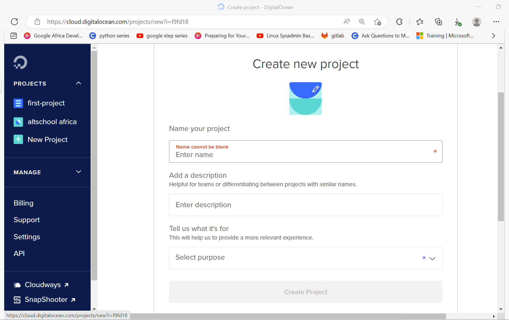
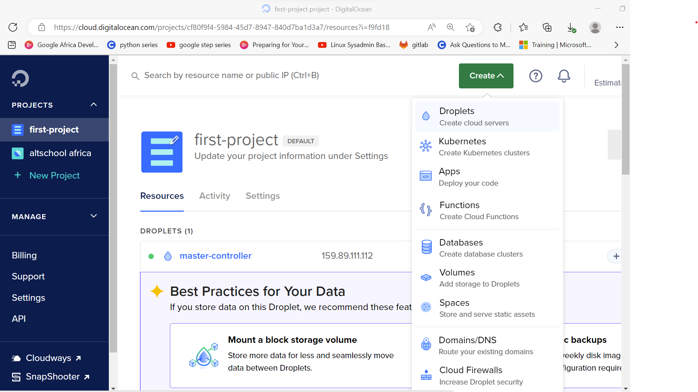
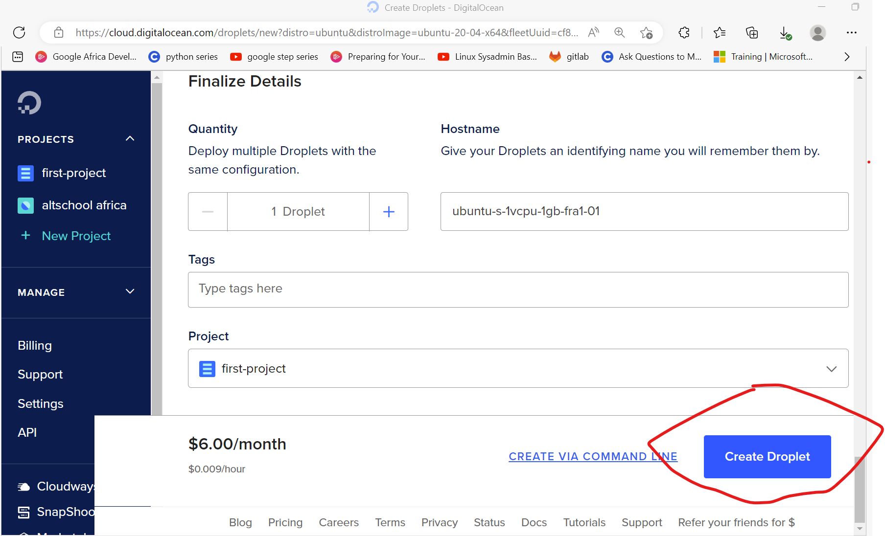
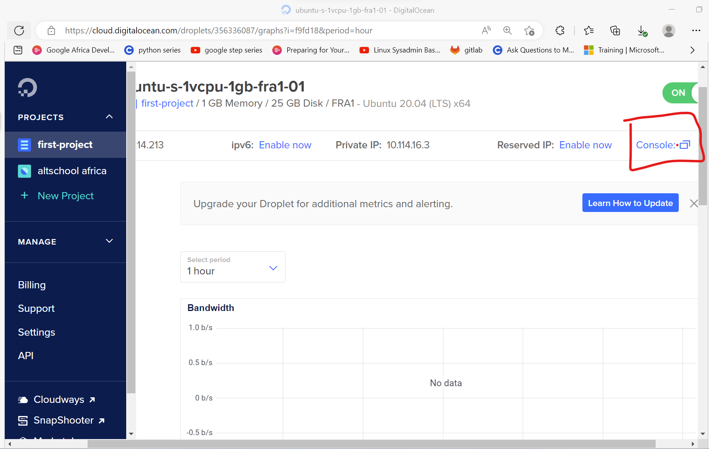
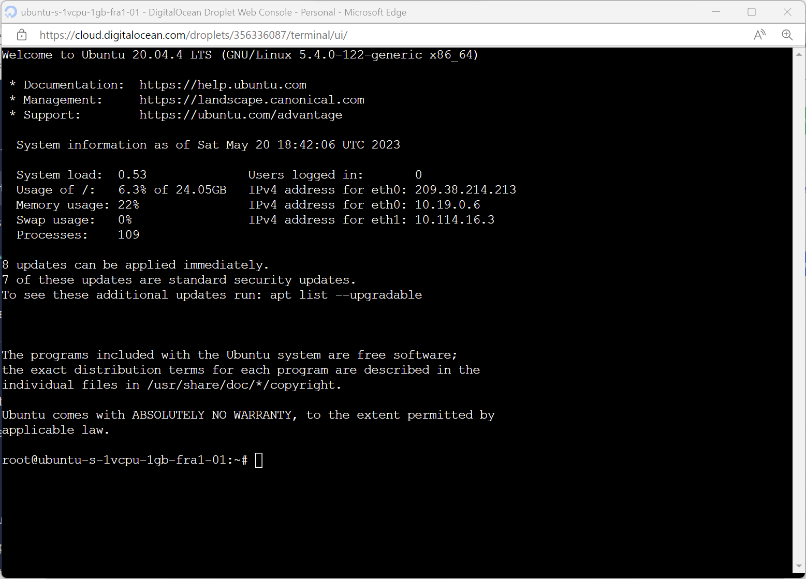
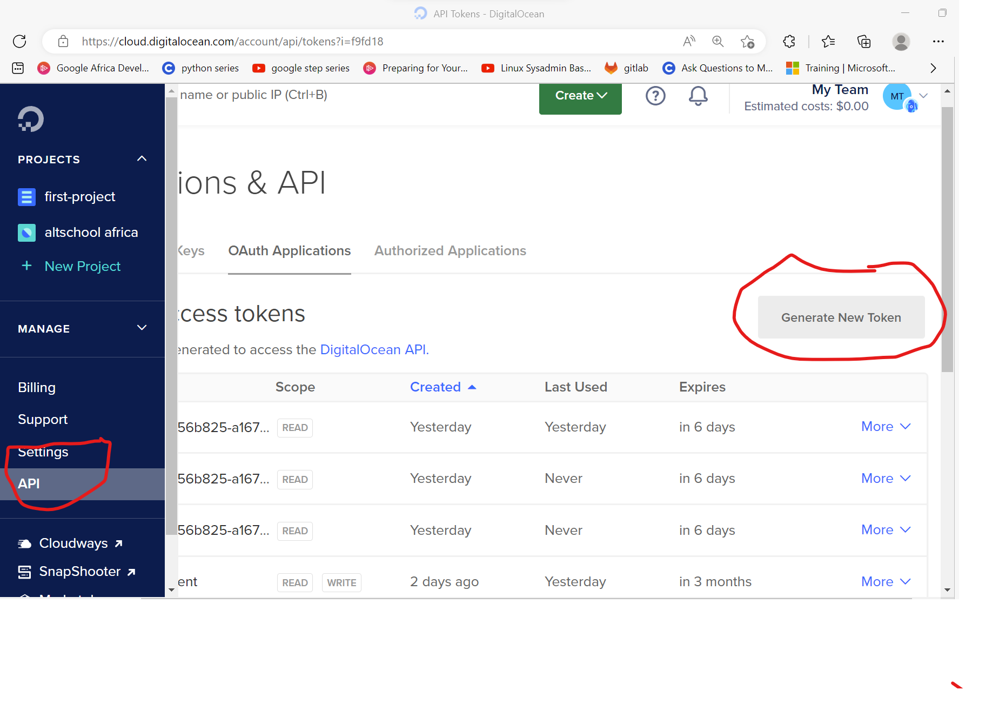
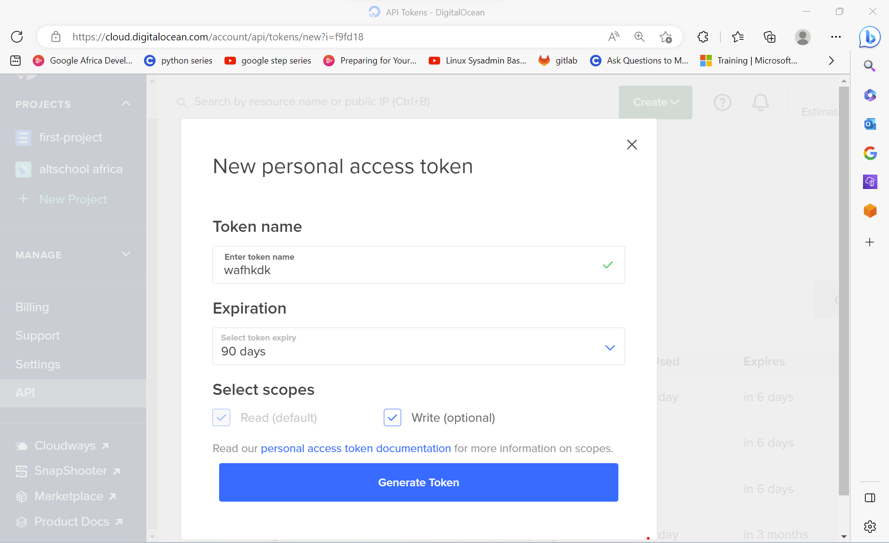
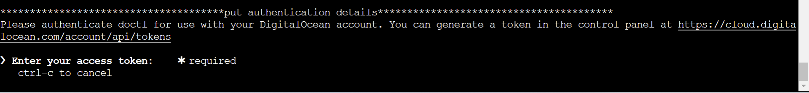
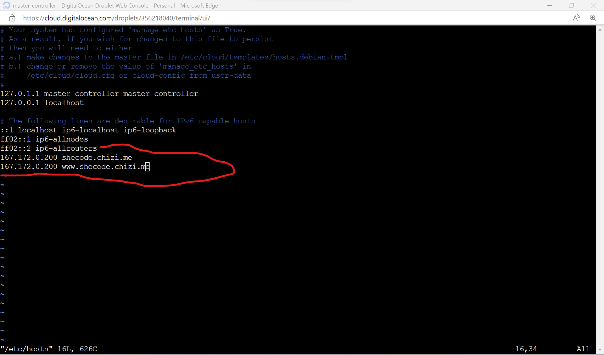

# Full-Stack Next.js Application Template

This repository is a full-stack sample web application based on Next.js that creates a simple whole-website architecture, and provides the foundational services, components, and plumbing needed to get a basic web application up and running.


## Table of Contents

- [Creating an Instance on Digital Ocean](#creating-an-instance-on-digital-ocean)
- [Installing Docker](#installing-docker)
- [Containerize the application and push it to docker hub](#containerize-the-application-and-push-it-to-docker-hub)
- [Generate API Token](#generate-api-token)
- [Deploy Image on Kubernetes](#deploy-image-on-kubernetes)
- [Contributing](#contributing)
- [Supported development environment](#supported-development-environment)
- [Licensing](#licensing)

## Creating an Instance on Digital Ocean

1. Create a digital ocean account and log into it. Then click on create new project. If you have an existing one you may skip this step
   

1. Enter the name of your project, a description and what it is going to be used for then click on create project. I already have a project so I will just be using my project called first project. Enter into your project and click on create at the top right of the screen. A drop down menu will appear. Click on create droplet.
   

1. Choose the region closest to you, I will be choosing Frankfurt for this tutorial and will be using an ubuntu image with version 20.04(LTS)x64, select the following options:

- Droplet type - Basic
- CPU options - Regular [1GB/1CPU, 25GB SSD Disk, 1000GB transfer]
- Authentication method: Password (would be better to use ssh key, but for simplification of this tutorial I'd use password however if you have an ssk key you can add it )
  
  Click on the droplet you just created and on the extreme right click on console.
  
  A window should be opened which looks like this
  

## Installing Docker

1. create a new file called script.sh using the command

```sh
 vim script.sh
```

2. copy the contents of the bash script below
   and paste it there using `cntrl + shift + v` or right clicking and selecting paste

```bash

#!/bin/bash

echo "***********************updating system*********************************************************************************************************"
sudo apt update
echo "***********************upgrading system**********************************************************************************************"
sudo apt upgrade -y
echo "***********************removing old docker***********************************************************************************************"
sudo apt-get remove docker docker-engine docker.io containerd runc
echo "***********************removing old docker******************************************************************************************"
sudo apt install apt-transport-https ca-certificates curl software-properties-common -y
echo "***********************Add GPG key******************************************************************************************************"
curl -fsSL https://download.docker.com/linux/ubuntu/gpg | sudo apt-key add -
echo "***********************add docker repo***********************************************************************************************"
sudo add-apt-repository "deb [arch=amd64] https://download.docker.com/linux/ubuntu $(lsb_release -cs) stable"
echo "***********************specify installation source*************************************************************************************"
apt-cache policy docker-ce
echo "***********************installing docker*********************************************************************************************"
sudo apt install docker-ce -y
echo "***********************check docker status************************************************************************************************"
echo "***********************add docker to group************************************************************************************************"
sudo usermod -aG docker $USER

```

## Containerize the application and push it to docker hub

1. You will need to clone the application to your server. Run the code below to do that.

```sh
git clone https://github.com/blipppto/fullstack-nextjs-app-template-1.git
```

2. Log into your docker account. If you do not have an account with docker hub you can create one [Here](https://hub.docker.com/). When you are done, run this code on your server

```ssh
docker login
```

input your docker username and password in the prompt that comes up

3.  Enter into the application, then build, run and push your image. The format to build your docker file is

`docker build -t <name of file>:version`

and the format to tag and push

`docker tag <name of image>:<version> <repository>:<version>`

`docker push <repository>`

The name of the file used in this tutorial will be called chizidockerizedapp and I am going to use version 1.0. Don't forget to change your repository name!!.

```sh
cd fullstack-nextjs-app-template-1.git

docker build -t chizidockerizedapp:1.0

docker tag chizidockerizedapp:1.0 <repository>:latest

docker push <repository>

```

## Generate API Token

1. Get API details. To do this, on the digital ocean console click on API at the bottom left and click on generate new token.



A pop up will come up asking you to input token name, expiration and scope. Ensure you check the write option for the scope. You can use any name you like for the token.

Then click on generate token and copy your token and keep it in a safe place. Note, the token usually begins with dop_v1

## Deploy Image on Kubernetes

1. Create a new document called script2.sh using the command

```bash
vim script2.sh
```

Copy and paste the bash script command below by using `cntrl + C` to copy it on this github page and `cntrl + shift + v` to paste it in the vim editor. Then type `:wq` to save and exit the editor

```vim
#!/bin/bash

sudo apt update
sudo apt upgrade -y
echo "*******************************************************installing doctl**************************************************************"
cd ~
wget https://github.com/digitalocean/doctl/releases/download/v1.94.0/doctl-1.94.0-linux-amd64.tar.gz
tar xf ~/doctl-1.94.0-linux-amd64.tar.gz
sudo mv ~/doctl /usr/local/bin
echo "**************************************put authentication details****************************************"
doctl auth init
doctl auth list
echo "*********************************************************install kubectl*********************************************************************"
curl -LO "https://dl.k8s.io/release/v1.26.3/bin/linux/amd64/kubectl"
chmod +x kubectl
sudo mv kubectl /usr/local/bin/
kubectl version --client
echo "*********************************************************creating cluster*********************************************************************"
doctl kubernetes cluster create shecode --tag do-tutorial --auto-upgrade=true --node-pool "name=shecode;count=1;auto-scale=true;min-nodes=1;max-nodes=2;tag=do-tutorial"
doctl kubernetes cluster kubeconfig save shecode
kubectl apply -f https://raw.githubusercontent.com/kubernetes/ingress-nginx/controller-v1.1.0/deploy/static/provider/do/deploy.yaml

```

write this code to run the script

```
bash script2.sh
```

Note that during the running of this code you will be asked to put your token like in the picture below and if you get any prompt concerning openssh just click on enter and proceed.



Also you can change your cluster name by replacing shecode with your desired name under the creating cluster section in the script which you can identify with asterics infront and behind the words _creating cluster_, such as below

`***********creating cluster*********`

You are almost done. All that is remaining is to create and run your kubernetes deployment file. to create your deployment file run

```bash
vim deployment.yaml
```

Then paste the content of the deployment file using `cntrl + shift + v`

if you do not have a domain name use this deployment file. You may change the image to your own image which you pushed on docker hub

```vim
apiVersion: apps/v1
kind: Deployment
metadata:
  name: my-deployment
spec:
  replicas: 1
  selector:
    matchLabels:
      app: my-app
  template:
    metadata:
      labels:
        app: my-app
    spec:
      containers:
        - name: shecode
          image: blipppto/chizidockerizedapp:1.0
          ports:
            - containerPort: 3000
---
apiVersion: v1
kind: Service
metadata:
  name: shecode-service
spec:
  selector:
    app: my-app
  type: LoadBalancer
  ports:
    - protocol: TCP
      port: 3000
      targetPort: 3000
      nodePort: 30000
```

If you have a domain name you should use this deployment file. You may change the image to your own image which you pushed on docker hub. Dont forget tp change your host name (which is shecode.chizi.me in the script below) to your actual domain name.

```bash

apiVersion: apps/v1
kind: Deployment
metadata:
  name: my-deployment
spec:
  replicas: 1
  selector:
    matchLabels:
      app: my-app
  template:
    metadata:
      labels:
        app: my-app
    spec:
      containers:
        - name: shecode
          image: blipppto/chizidockerizedapp:1.0
          ports:
            - containerPort: 3000
---
apiVersion: v1
kind: Service
metadata:
  name: shecode-service
spec:
  selector:
    app: my-app
  ports:
    - protocol: TCP
      port: 3000
      targetPort: 3000

---
apiVersion: networking.k8s.io/v1
kind: Ingress
metadata:
  name: shecode-ingress
  annotations:
    kubernetes.io/ingress.class: "nginx"
spec:
  rules:
  - host: shecode.chizi.me
    http:
      paths:
          - path: /
            pathType: Prefix
            backend:
              service:
                name: shecode-service
                port:
                  number: 3000

```

To run the deployment, use the code below

```
kubectl apply -f deployment.yaml
```

To check the IP address which the container is running on, use the code below

```
kubectl get service
```

If you ran the deployment file that does not require a domain name, you will see the external IP address of shecode-service and its port. Go to a new tab in your browser input `<the external IP Address>:<portnumber>` and your service is deployed

However if you ran the deployment file that requires a domain name when yu run th get service command you will see something similar to what is below


take note of the clusterIP of shecode-service

edit your /etc/hosts file by using the command

```
vim /etc/hosts
```

press i on your keyboard to be able to edit it. at the bottom of the file add these lines

```
<Cluster ip address> <domain name>
www.<cluster ip address> <domanin name>
```

It should be similar to the picture below


Finally go to your webhosting site and add your domain name record

## Contributing

- [React](https://reactjs.org/)
- [nextjs](https://nextjs.org/)
- [redux](https://redux.js.org/)
- [axios](https://github.com/axios/axios)
- [Express](http://expressjs.com/)
- [php-express](https://github.com/fnobi/php-express)
- [next-cookies](https://github.com/matthewmueller/next-cookies)
- [pm2](https://pm2.keymetrics.io/)

## Supported development environment

- Next.js 13.x +
- React 18 +
- TypeScript 4.x.x +
- Express 4.x.x

## Licensing

Licensed under the [MIT](https://opensource.org/licenses/MIT).
